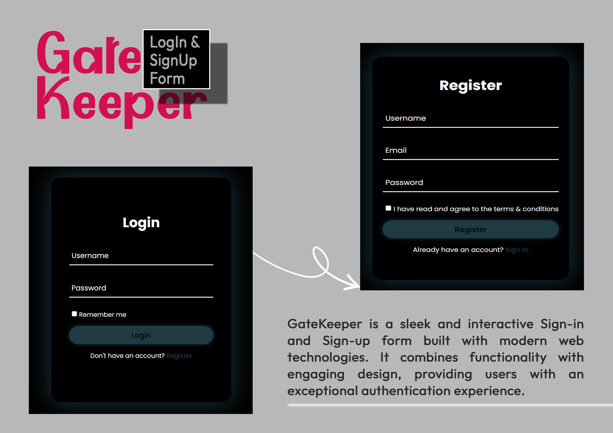

# GateKeeper

GateKeeper is a sleek and interactive Sign-in and Sign-up form built with modern web technologies. It combines functionality with engaging design, providing users with an exceptional authentication experience

## Features

* Animated Elements: Smooth transitions and animations enhance the user interface.
* "Remember Me" Button: Lets users stay signed in for future sessions.
* Glowing Background Effect: A visually captivating aesthetic for a modern look and feel.

## Technologies Used

* HTML: Structuring the form elements and content.
* CSS: Styling and animations to create a vibrant, responsive design.
* JavaScript: Adding interactivity and handling form logic.

## Installation

1. Clone the repository:

```bash
git clone https://github.com/your-username/gatekeeper.git  
```

2. Navigate to the project directory:

```bash
cd gatekeeper  
```

3. Open the index.html file in your browser to view the application.

## Usage

1. Launch the application by opening the `index.html` file.
2. Use the Sign-in or Sign-up form as needed.
3. Toggle the "Remember Me" button to enable persistent login sessions.

## Screenshots



## Contributing

Contributions are welcome! Please open an issue or submit a pull request to improve the project.

## License

This project is licensed under the GNU General Public License v3.0.  
