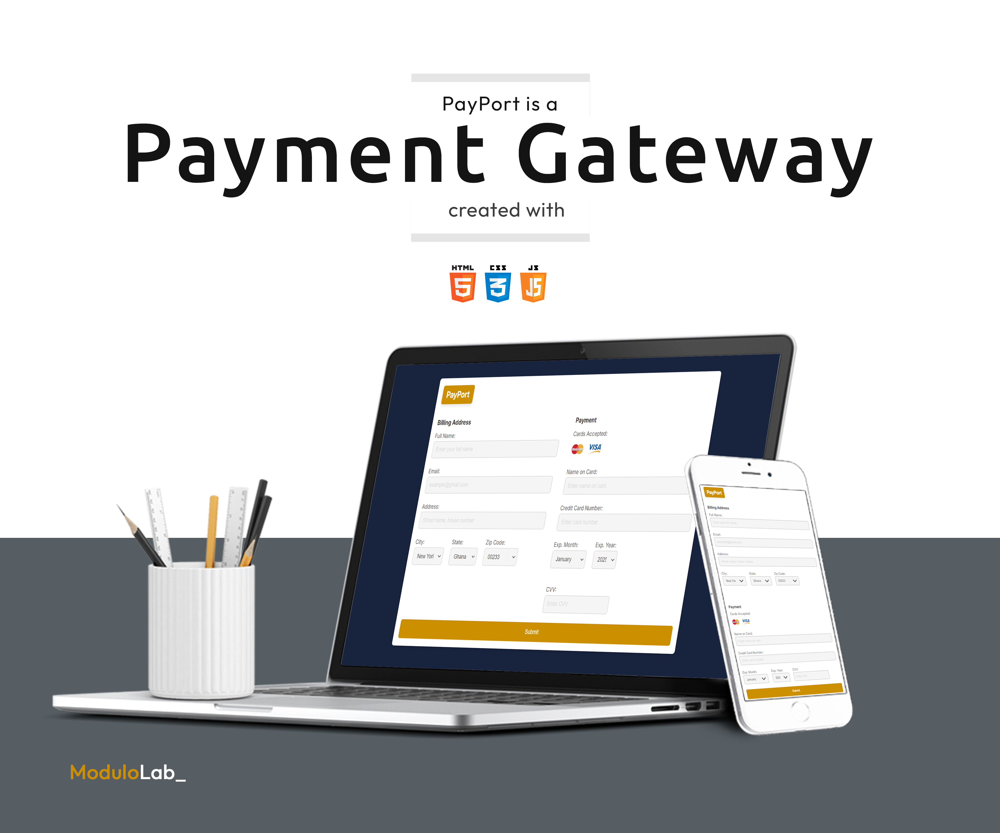

# PayPort Payment Gateway

PayPort is a responsive payment gateway application designed to provide a seamless and secure checkout experience. It supports multiple payment methods and includes essential features to ensure efficient handling of payment and billing information.

## Features

* Billing Address Column: Easily input and manage customer billing details.
* Payment Options:
  * Supports major card types, including:
    * Credit Cards
    * Visa
    * MasterCard
  * Input fields for:
    * Card Number
    * CVV
* Responsiveness: Designed to deliver a consistent user experience across all devices and screen sizes.

## Technologies Used

* HTML: Structure and semantic layout.
* CSS: Styling for a visually appealing and responsive design.
* JavaScript: Interactive and dynamic user functionalities

## Getting Started

Prerequisites
Ensure you have a modern web browser installed to view and test the application.

Installation

1. Clone the repository

```Bash
git clone https://github.com/username/payport.git
```

2. Open the project directory:

```Bash
cd payport
```

3. Launch the application:

* Open the `index.html` file in your browser.

## Usage

* Enter Billing Information: Fill out the form with your billing address.
* Provide Payment Details: Input your card number and CVV.
* Submit Payment: Complete your transaction securely.

## Contributions

Contributions, issues, and feature requests are welcome! Feel free to open an issue or submit a pull request.

## License

This project is licensed under the MIT License.


